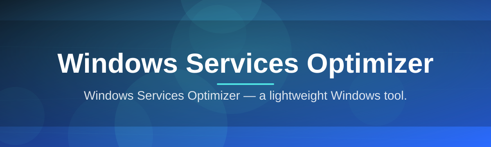

# Windows-Services-Optimizer-1698

Windows Services Optimizer — a lightweight Windows tool.

  

## Overview

Windows Services Optimizer — a lightweight Windows tool.

## License

[MIT License](LICENSE)
